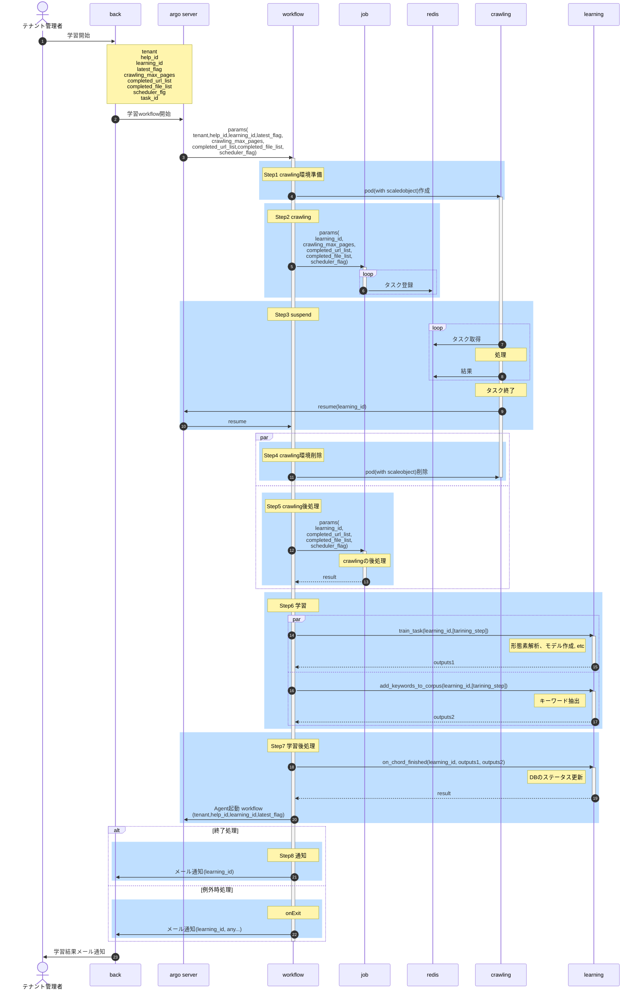

# 学習ワークフロー ver. 0.2

```mermaid
sequenceDiagram
    autonumber
    actor admin as テナント管理者
    participant back as back
    participant argo as argo server
    participant workflow as workflow
    participant job as job
    participant queue as redis
    participant crawling as crawling
    admin ->> back: 学習開始
    Note over back,argo: tenant<br/>help_id<br/>learning_id<br/>latest_flag<br/>crawling_max_pages<br/>completed_url_list<br/>completed_file_list<br/>scheduler_flg<br/>task_id
    back ->> argo: 学習workflow開始
    argo ->> workflow: params(<br/>tenant,help_id,learning_id,latest_flag,<br/>crawling_max_pages,<br/>completed_url_list,completed_file_list,<br/>scheduler_flag)
    activate workflow
    rect rgb(191, 223, 255)
        Note over workflow: Step1 crawling環境準備
        workflow ->> crawling: pod(with scaledobject)作成
        activate crawling
    end
    rect rgb(191, 223, 255)
        Note over workflow: Step2 crawling
        workflow ->> job: params(<br/>learning_id,<br/>crawling_max_pages,<br/>completed_url_list,<br/>completed_file_list,<br/>scheduler_flag)
        activate job
        loop
            job ->> queue: タスク登録
        end
        deactivate job
    end
    rect rgb(191, 223, 255)
        Note over workflow: Step3 suspend
        loop
            crawling ->> queue: タスク取得
            Note over crawling: 処理
            crawling ->> queue: 結果
        end
        Note over crawling: タスク終了
        crawling ->> argo: resume(learning_id)
        argo ->> workflow: resume
    end
    par
        rect rgb(191, 223, 255)
            Note over workflow: Step4 crawling環境削除
            workflow ->> crawling: pod(with scaleobject)削除
            deactivate crawling
        end
    and
        rect rgb(191, 223, 255)
            Note over workflow: Step5 crawling後処理
            workflow ->> job: params(<br/>learning_id,<br/>completed_url_list,<br/>completed_file_list,<br/>scheduler_flag)
            activate job
            Note over job: crawlingの後処理
            job -->> workflow: result
            deactivate job
        end
    end
    rect rgb(191, 223, 255)
        Note over workflow: Step6 学習
        par
            workflow ->> learning: train_task(learning_id,[tarining_step])
            activate learning
            Note left of learning: 形態素解析、モデル作成, etc
            learning -->> workflow: outputs1
            deactivate learning
        and
            workflow ->> learning: add_keywords_to_corpus(learning_id,[tarining_step])
            activate learning
            Note left of learning: キーワード抽出
            learning -->> workflow: outputs2
            deactivate learning
        end
        %% workflow ->> learning2: add_keywords_to_corpus
        %% activate learning2
        %% deactivate learning2
    end
    rect rgb(191, 223, 255)
        Note over workflow: Step7 学習後処理
        workflow ->> learning: on_chord_finished(learning_id, outputs1, outputs2)
        activate learning
        Note left of learning: DBのステータス更新
        learning -->> workflow: result
        deactivate learning
        workflow ->> argo: Agent起動 workflow<br/>(tenant,help_id,learning_id,latest_flag)
    end
    alt 終了処理
        rect rgb(191, 223, 255)
            Note over workflow: Step8 通知
            workflow ->> back: メール通知(learning_id)
        end
    else　例外時処理
        rect rgb(191, 223, 255)
            Note over workflow: onExit
            workflow ->> back: メール通知(learning_id, any...)
        end
    end
    deactivate workflow
    back ->> admin: 学習結果メール通知
```
