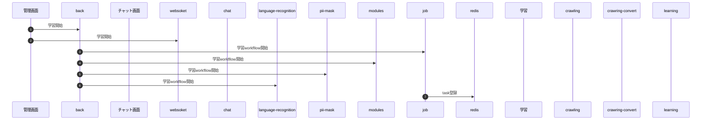
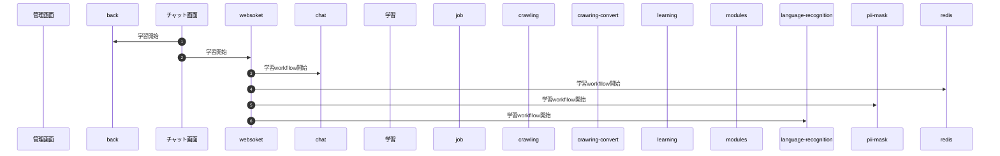
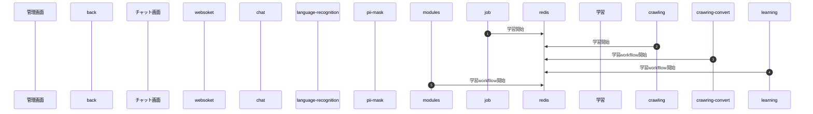

# シーケンス図(管理画面/チャット/学習)

```mermaid
sequenceDiagram
    autonumber
    participant frontmanagement as 管理画面
    participant back as back
    
    participant frontchat as チャット画面
    participant websoket as websoket
    participant chat as chat
    participant language as language-recognition
    participant piimask as pii-mask
    participant modules as modules
    participant job as job
    participant redis as redis
    
    participant leaning as 学習
    participant job as job
    participant crawling as crawling
    participant crawlingconvert as crawring-convert
    participant learning as learning
    participant modules as modules
    
    frontmanagement ->> back: 学習開始
    frontmanagement ->> websoket: 学習開始
    back ->> job: 学習workfllow開始
    back ->> modules: 学習workfllow開始
    back ->> piimask: 学習workfllow開始
    back ->> language: 学習workfllow開始
    job ->> redis: task登録
    

```

```mermaid
sequenceDiagram
    autonumber
    participant frontmanagement as 管理画面
    participant back as back
    
    participant frontchat as チャット画面
    participant websoket as websoket
    participant chat as chat
    
    participant leaning as 学習
    participant job as job
    participant crawling as crawling
    participant crawlingconvert as crawring-convert
    participant learning as learning
    participant modules as modules

    participant language as language-recognition
    participant piimask as pii-mask
    participant modules as modules
    participant job as job
    participant redis as redis

    frontchat ->> back: 学習開始
    frontchat ->> websoket: 学習開始
    websoket ->> chat: 学習workfllow開始
    websoket ->> redis: 学習workfllow開始
    websoket ->> piimask: 学習workfllow開始
    websoket ->> language: 学習workfllow開始
    

```

```mermaid
sequenceDiagram
    autonumber
    participant frontmanagement as 管理画面
    participant back as back
    
    participant frontchat as チャット画面
    participant websoket as websoket
    participant chat as chat
    participant language as language-recognition
    participant piimask as pii-mask
    participant modules as modules
    participant job as job
    participant redis as redis
    
    participant leaning as 学習
    participant job as job
    participant crawling as crawling
    participant crawlingconvert as crawring-convert
    participant learning as learning
    participant modules as modules
    
    job ->> redis: 学習開始
    crawling ->> redis: 学習開始
    crawlingconvert ->> redis: 学習workfllow開始
    learning ->> redis: 学習workfllow開始
    modules ->> redis: 学習workfllow開始

    

```

