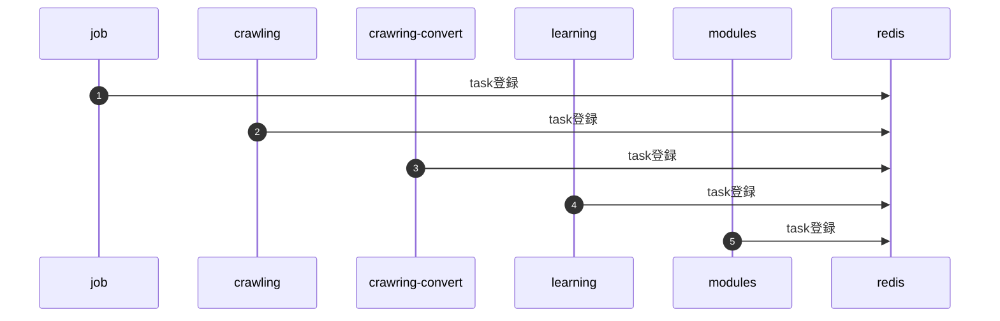
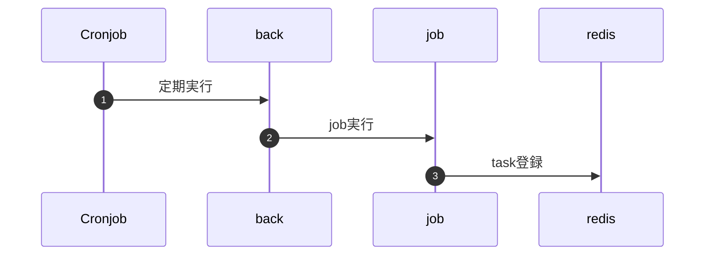

# シーケンス図(管理画面/チャット/学習)

```mermaid
sequenceDiagram
    autonumber
    participant frontmanagement as 管理画面
    participant back as back
    
    participant frontchat as チャット画面
    participant websoket as websoket
    participant chat as chat
    participant language as language-recognition
    participant piimask as pii-mask
    participant modules as modules
    participant job as job
    
    participant karpenter as karpenter
    
    participant karpenter as keda-operator
    participant karpenter as keda-operator-metrics-apiserver
    
    participant agentmonitoring as agent-monitoring
    participant backchat as back-chat
    participant backlearning as back-learning
    participant cleanchat as clean-chat
    participant crawlingapp as crawling-app
    participant cutoffmail as cutoff-mail
    participant backlearning as back-learning
    participant checkchat as check-chat
    participant crawlingconvert as crawling-convert
    participant learnscheduler as learn-scheduler
    participant opeserver as ope-server
    participant reportjob as report-job
    participant updateplan as update-plan
    participant wakeup as wakeup
    participant internalingresscontroller as internal-ingress-controller
    participant argoworkflowserver as argo-workflow-server
    participant argoworkflowcontroller as argo-workflow-controller
    
    participant redis as redis
    
    frontmanagement ->> back: 学習開始
    frontmanagement ->> websoket: 学習開始
    
    back ->> language: 学習workfllow開始
    back ->> piimask: 学習workfllow開始
    back ->> modules: 学習workfllow開始
    back ->> job: 学習workfllow開始
    job ->> redis: task登録
    
    websoket ->> language: 学習workfllow開始
    websoket ->> piimask: 学習workfllow開始
    websoket ->> redis: task登録
```

```mermaid
sequenceDiagram
    autonumber
    participant frontmanagement as 管理画面
    participant back as back
    
    participant frontchat as チャット画面
    participant websoket as websoket
    participant chat as chat
    
    participant language as language-recognition
    participant piimask as pii-mask
    participant modules as modules
    participant job as job
    
    participant karpenter as karpenter
    
    participant karpenter as keda-operator
    participant karpenter as keda-operator-metrics-apiserver
    
    participant agentmonitoring as agent-monitoring
    participant backchat as back-chat
    participant backlearning as back-learning
    participant cleanchat as clean-chat
    participant crawlingapp as crawling-app
    participant cutoffmail as cutoff-mail
    participant backlearning as back-learning
    participant checkchat as check-chat
    participant crawlingconvert as crawling-convert
    participant learnscheduler as learn-scheduler
    participant opeserver as ope-server
    participant reportjob as report-job
    participant updateplan as update-plan
    participant wakeup as wakeup
    participant internalingresscontroller as internal-ingress-controller
    participant argoworkflowserver as argo-workflow-server
    participant argoworkflowcontroller as argo-workflow-controller
    
    participant redis as redis

    frontchat ->> back: 学習開始
    frontchat ->> websoket: 学習開始
    
    back ->> language: 学習workfllow開始
    back ->> piimask: 学習workfllow開始
    back ->> modules: 学習workfllow開始
    back ->> job: 学習workfllow開始
    job ->> redis: task登録
    
    websoket ->> chat: 学習workfllow開始
    websoket ->> language: 学習workfllow開始
    websoket ->> piimask: 学習workfllow開始
    websoket ->> redis: task登録


    

```

```mermaid
sequenceDiagram
    autonumber
    
    participant job as job
    participant crawling as crawling
    participant crawlingconvert as crawring-convert
    participant learning as learning
    participant modules as modules
    
    job ->> redis: task登録
    crawling ->> redis: task登録
    crawlingconvert ->> redis: task登録
    learning ->> redis: task登録
    modules ->> redis: task登録

    

```

```mermaid
sequenceDiagram
    autonumber
    
    participant Cronjob as Cronjob
    participant back as back
    participant job as job
    
    participant redis as redis
    
    Cronjob ->> back: 定期実行
    back ->> job: job実行
    job ->> redis: task登録
    

```
